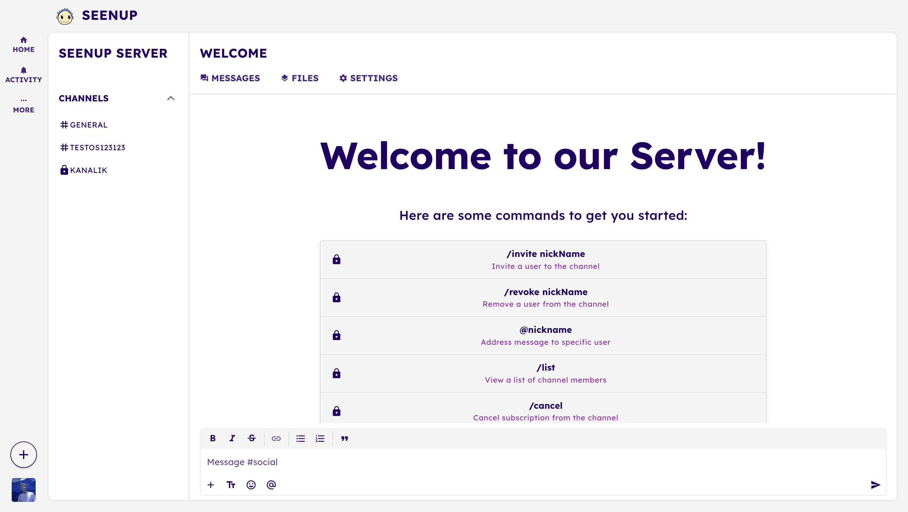
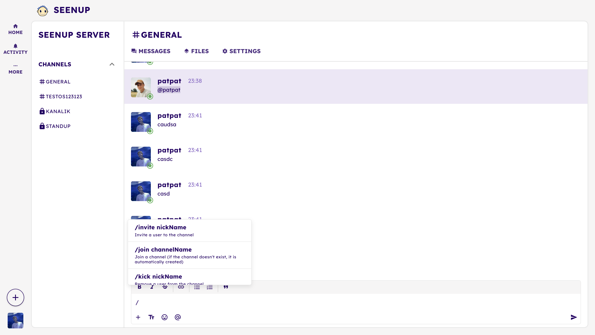

# SeenUp - IRC Progressive Web App
Welcome to SeenUp, where modern communication meets IRC-style simplicity.
Create and manage public or private channels, send direct messages, and enjoy real-time collaboration with features like
typing indicators, and customizable notifications.
Whether you’re chatting casually or leading a team, SeenUp keeps you connected with intuitive commands and dynamic tools.
Built for seamless interaction, SeenUp puts you in control. This project was proudly crafted for VPWA.






## Table of Contents
- [Folder structure](#folder-structure)
- [Getting Started](#getting-started)
  - [Prerequisites](#prerequisites)
- [Installation](#installation)
- [Database Configuration](#database-configuration)
- [Usage](#usage)
  - [Client](#client)
    - [PWA (Progressive Web App)](#pwa-progressive-web-app)
    - [SPA (Single Page Application)](#spa-single-page-application)
  - [Server](#server)
- [License](#license)

## Folder structure
    .
    ├── seenup-client
    │   ├── db_models 
    │   │   ├── first_iteration   # Logical database model for the first iteration
    │   │   └── second_iteration  # Physical database model for the second iteration
    │   ├── public 
    │   │   ├── avatars  # Users avatars
    │   │   ├── docs     # Documentation images
    │   │   └── icons    # Application icons generated by icongenie
    │   ├── src 
    │   │   ├── assets   # Application assets (most of them used only for first iteration of the project)
    │   │   ├── boot     # Boot files (socket.io, axios, etc.)
    │   │   ├── components  # Vue components
    │   │   ├── contracts  # Interfaces and types
    │   │   ├── css       # Application styles
    │   │   ├── layouts   # Application layouts
    │   │   ├── pages     # Application pages
    │   │   ├── router
    │   │   │   ├── index.ts  # Router configuration
    │   │   │   └── routes.ts  # Application routes
    │   │   ├── services 
    │   │   │   ├── ActivityService.ts # Manage user activities
    │   │   │   ├── AuthManager.ts   # Manage user authentication
    │   │   │   ├── AuthService.ts   # Handle authentication API requests
    │   │   │   ├── ChannelService.ts # Manage channel socket and events
    │   │   │   ├── index.ts         # Export all services
    │   │   │   └── SocketManager.ts # Socket manager 
    │   │   ├── stores
    │   │   │   ├── module-auth # Manage authentification state and actions
    │   │   │   ├── module-channels  # Handles channels state management
    │   │   │   ├── index.ts # Set up the Piniia store
    │   │   │   └── ...
    │   │   ├── App.vue # Main application component
    │   │   └── ...
    │   ├── src-pwa # PWA configuration
    │   ├── quasar.conf.js # Quasar configuration
    │   ├── tsconfig.json # TypeScript configuration
    │   ├── ...
    │   └──package.json # Frontend dependencies
    │  
    ├── seenup-server
    │   ├── app
    │   │   ├── Controllers
    │   │   │   ├── Http # HTTP controllers
    │   │   │   └── Ws # Websocket controllers
    │   │   ├──  Exceptions # Handlers for exceptions
    │   │   ├──  Middleware 
    │   │   │   ├── Auth.ts # Authentication middleware
    │   │   │   └── ...
    │   │   ├──  Models
    │   │   │   ├── Channel.ts # Channel model
    │   │   │   ├── Message.ts # Message model
    │   │   │   └── User.ts # User model
    │   │   ├──  Repositories
    │   │   │   └── MessageRepository.ts # Manage message retrieval and creation
    │   │   ├──  Services
    │   │   │   └── ChannelCleanupService.ts # Service for deleting inactive channels
    │   │   ├──  Validators # Validation rules files
    │   ├── commands
    │   │   ├── commands.ts # Removes inactive channels
    │   │   └── index.ts # Export all commands
    │   ├── config # Configuration files
    │   ├── contracts # Interfaces and types
    │   ├── database
    │   │   ├── factories # Database factories
    │   │   ├── migrations # Database migrations
    │   │   └── seeds # Database seeds
    │   ├── providers # Configures and manages IoC bindings
    │   ├── start # Application start files
    │   │   ├── kernel.ts # Application kernel 
    │   │   ├── routes.ts # Application routes
    │   │   ├── socket.ts # Socket namespace configuration and events
    │   │   ├── wsKernel.ts # WebSocket middleware
    │   │   └── ...
    │   ├── test # Application tests
    │   ├── .adonisrc.json # Adonis configuration
    │   ├── .env.example # Example environment variables
    │   ├── ...
    │   └── package.json # Backend dependencies
    │
    └── README.md


## Getting Started
### Prerequisites
Before proceeding, make sure you have the following installed on your machine:

- [Git](https://git-scm.com/)
- [Node](https://nodejs.org/en) (minimum version 20)
- [npm](https://www.npmjs.com/) which comes with Node.js installation
- [Quasar CLI](https://quasar.dev/start/quasar-cli/) (optional)
- [PostgreSQL](https://www.postgresql.org/)

Verify installation: 
``` bash
node --version
```
``` bash
npm --version
```

## Installation
First, clone the project from the Git repository locally.
Navigate to the directory where you want to clone the project and run:
``` bash
git clone git@github.com:tomasdrga/seenup.git
```
Navigate to the project directory:
``` bash
cd seenup
```
### Install the frontend dependencies
Navigate to the `frontend` directory:
``` bash
cd seenup-client
```
Install the dependencies:
``` bash
npm install
```
### Install the backend dependencies
Navigate to the `backend` directory:
``` bash
cd seenup-server
```
Install the dependencies:
``` bash
npm install
```

## Database Configuration
Create a new PostgreSQL database and user. Get into PSQL with user `example`:
``` bash
psql -U example;
```
In the PSQL shell, create a new database:
``` psql
CREATE DATABASE seenup_development;
```
Navigate to the `backend` directory:
``` bash
cd seenup-server
```
Create a `.env` file:
``` bash
touch .env
```
Add the following environment variables to the `.env` file:
``` ts
PORT=
HOST=
NODE_ENV=
APP_KEY=
DRIVE_DISK=
DB_CONNECTION=
PG_HOST=
PG_PORT=
PG_USER=
PG_PASSWORD=
PG_DB_NAME=
```

Run the database migrations:
``` bash
 node ace migration:run 
```

## Usage
### Client
Navigate to the `frontend` directory:
``` bash
cd seenup-client
```
Run the application:
You can run the application as a PWA or SPA.
#### PWA (Progressive Web App)
To run the application as a PWA:
``` bash
quasar dev -m pwa
```
Or if you don't have Quasar CLI installed:
``` bash
npm run dev -m pwa
```
#### SPA (Single Page Application)
To run the application as a SPA:
``` bash
quasar dev
```
Or if you don't have Quasar CLI installed:
``` bash
npm run dev
```

After running the application, you can access it at `http://localhost:8081/`.

### Server
Navigate to the `backend` directory:
``` bash
cd seenup-server
```
Run the server:
``` bash
node ace serve --watch  
```
Now server is running on`http://127.0.0.1:3333 `.


## License

*   This project is open-sourced software licensed under the [MIT license](https://opensource.org/licenses/MIT).

---
*   **Credits:** Matej Drienovský, Tomáš Drga, Eduard Kuric

